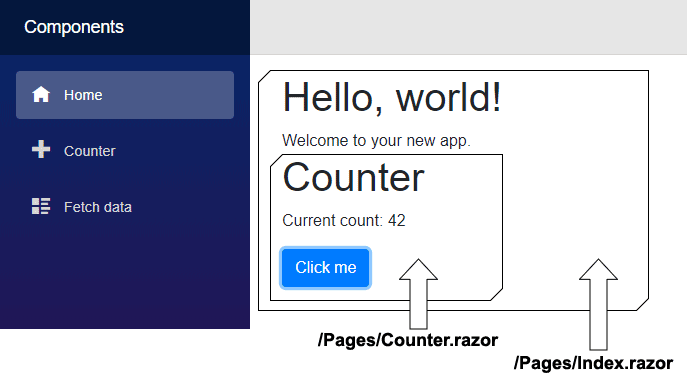

All rendered Blazor views descend from the `ComponentBase` class, this includes Layouts, Pages, and also Components.

A Blazor page is essentially a component with a `@page` directive that specifies the URL the browser must navigate to in order for it to be rendered. In fact, if we compare the generated code for a component and a page there is very little difference.

The following generated source code can be found in `obj\Debug\netcoreapp3.0\Razor\Pages\Counter.razor.g.cs` for Blazor 3 apps, and in `obj\Debug\{DotNetVersion{\generated\Microsoft.NET.Sdk.Razor.SourceGenerators\Microsoft.NET.Sdk.Razor.SourceGenerators.RazorSourceGenerator\Pages_Counter_razor.g.s` in Blazor 5 or later.

Note that after Blazor version 3 these automatically files are no longer automatically written to disk. To re-enable this feature, edit your `csproj` file and add the following:

```
<PropertyGroup>
 <EmitCompilerGeneratedFiles>true</EmitCompilerGeneratedFiles>
</PropertyGroup>
```

namespace MyFirstBlazorApp.Client.Pages
{
    \[Microsoft.AspNetCore.Components.LayoutAttribute(typeof(MainLayout))\]
    \[Microsoft.AspNetCore.Components.RouteAttribute("/counter")\]
    public class Counter : Microsoft.AspNetCore.Components.ComponentBase
    {
        protected override void BuildRenderTree(Microsoft.AspNetCore.Components.RenderTree.RenderTreeBuilder builder)
        {
            // Code omitted for brevity
        }

    private int counter = 42;

    private void IncrementCounter()
    {
        counter++;
    }
  }
}

`[Microsoft.AspNetCore.Components.RouteAttribute("/counter")]` identifies the URL for the page.

`[Microsoft.AspNetCore.Components.LayoutAttribute(typeof(MainLayout))]` identifies which layout to use.

In fact, because pages are merely components decorated with additional attributes, if you alter the **Pages/Index.razor** file of a default Blazor app, it is possible to embed the **Counter** page as a component.

@page "/"

<h1>Hello, world!</h1>
Welcome to your new app.
<Counter/>



When embedding a page within another page, Blazor treats it as a component. The `LayoutAttribute` on the embedded page is ignored because Blazor already has an explicit container - the parent component that contains it.

