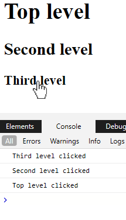

Directives are built-in macros that alter the transpiled C# code that is generated from Razor mark-up. Directives are used by preceding the identifier with the `@` symbol, the identifier being what we'd typically expect to be either the name of an HTML attribute or the name of a component's property. If you haven't done so already, read [Literals, expressions, and directives](/components/literals-expressions-and-directives).

**Note:** Currently, unlike other frameworks such as Angular, Blazor does not allow developers to create their own directives.

Because the type of the value assigned to the directive is known (it is strongly typed in C# code) the value will be inferred to be an expression. So, as with component properties, adding the `@` at the start of assigned value is unnecessary unless we wish to pass an expression to a directive that expects a string value. An exception to this is when we wish to pass a lambda; lambdas must be escaped with an `@` symbol and enclosed with brackets.

@onclick=@( args => Debug.WriteLine("Clicked") )

The following code shows how the `@onclick` directive is used to add the DOM onclick event to a rendered H1 element.

// Razor mark-up with @ref directive
<h1 @onclick=H1Clicked>Hello, world!</h1>

@code
{
	public void H1Clicked(MouseEventArgs args)
	{
		System.Diagnostics.Debug.WriteLine("H1 clicked");
	}
}

// Transpiled C#
public partial class Index : Microsoft.AspNetCore.Components.ComponentBase
{
	protected override void BuildRenderTree(RenderTreeBuilder \_\_builder)
	{
		\_\_builder.OpenElement(0, "h1");
		\_\_builder.AddAttribute(1, "onclick", EventCallback.Factory.Create<Microsoft.AspNetCore.Components.Web.MouseEventArgs>(this, H1Clicked));
		\_\_builder.AddContent(2, "Hello, world!");
		\_\_builder.CloseElement();
	}
}

- **Line 2**  
    Defines an H1 element with the `@onclick` directive.
- **Line 18**  
    Shows how the `@onclick=H1Clicked` directive is transpiled so that the DOM `onclick` event is set on the rendered element.

Some standard directives applicable to the Razor file itself are:

- `@code`  
    This directive identifies a block of C# code that should be output as-is into the resulting C# file. It is possible to have multiple `@code` directives in a single Razor mark-up file; Blazor will collate these to a single block of C# code in the transpiled file.
- `@page`  
    This directive generates a `[RouteAttribute]` on the transpiled class (`[PageAttribute]` in Blazor 3) , enabling [Blazor routing](/routing) (covered later) to identify which component (page) to render given a specific address in the URL.
- `@layout`  
    Generates a `[LayoutAttribute]` on the transpiled class. Blazor uses this to determine which [Layout](/layouts) to use (if any) to wrap the contents of a page.
- `@typeparam`  
    Instructs Blazor to generate a generic class from the Razor mark-up.
- `@inject`  
    Allows components to specify dependencies they require to be injected by Blazor when it creates a new instance of the component.
- `@attribute`  
    Adds the specified DotNet attribute to the generated C# class.

The following is a small set of examples of directives that can be applied to components and HTML elements that the current Razor file is consuming. For example `<h1 @ref=MyH1Element>Hello</h1>`.

- `@ref`  
    Identifies a member or property of the current component that should hold a reference to an HTML element or component that will be rendered. These can be used as references when using [JavaScript Interop](/javascript-interop/calling-javascript-from-dotnet/passing-html-element-references/), or to obtain a reference to an embedded Blazor component so that we can invoke methods on it.
- `@bind`  
    Allows us to data bind ([Two way binding](/javascript-interop/calling-javascript-from-dotnet/passing-html-element-references/)) to the property of a component being consumed, or the attribute of an HTML element.
- `@attributes`  
    [Outputs name-value pairs](/components/code-generated-html-attributes/) as HTML attributes.
- `@key`  
    Gives us the ability to give elements/components a unique identifier, which helps keep change deltas small when [rendering](/components/render-trees/) to HTML.

And the following is a subset of HTML DOM element events that are available. These will be convered in more detail in [Component events](/components/component-events).

- `@onmousemove`
- `@onclick`
- `@onkeypress`
- `@onscroll`

## Directive attributes

Directive attributes allow us to pass additional information to directives. If we think of a directive as a class, then directive attributes are its members.

To pass this additional information we need to repeat the directive, and then append a `:` followed by the name of the attribute that the directive supports.

For example, by default our browser will propagate an element's events up the tree until it finally reaches the HTML document itself. A plain HTML + JavaScript demonstration of this would be to output text to the console when an element is clicked.

<html>
	<body>
		

			<h1>Top level</h1>
			

				<h2>Second level</h2>
				

					<h3>Third level</h3>
				

			

		

	</body>
</html>

Because the `div` elements are nested, when one of them is clicked that event will trigger not only the `onclick` code on the `div` itself, but it will also trigger the `onclick` on its parent `div`, which in turn will trigger then event on its own parent `div` - and so on, until the current element has no parent.

Console output when the Third level header is clicked

To prevent an event propagating up the element tree JavaScript has a [stopPropagation method](https://www.w3schools.com/jsref/event_stoppropagation.asp) on the event. Blazor prevents propagation using a directive attribute - `@onclick:stopPropagation`.

@page "/"
@using System.Diagnostics

	<h1>Top level</h1>
	

		<h2>Second level</h2>
		

			<h3>Third level</h3>
		

	

@code
{
	private void TopLevelClicked()
	{
		Debug.WriteLine("Top level clicked");
	}

	private void SecondLevelClicked()
	{
		Debug.WriteLine("Second level clicked");
	}

	private void ThirdLevelClicked()
	{
		Debug.WriteLine("Third level clicked");
	}
}

Lines 4, 6, and 8 all define the `@onclick` attribute and declare which C# method to execute when the Browser `onclick` event is triggerred. Line 6 adds an additional `@onclick:stopPropagation` to prevent the browser propagating the click up from the second to the first level. More DOM events will be covered in the section about DOM events.

Some directive attributes expect us to specify a value in the form `@directive:attribute="value"`. We'll cover this in detail in the section on [Two-way binding](/components/two-way-binding/).

