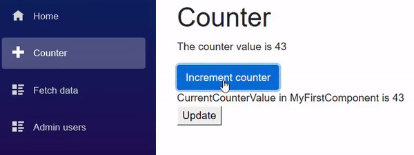
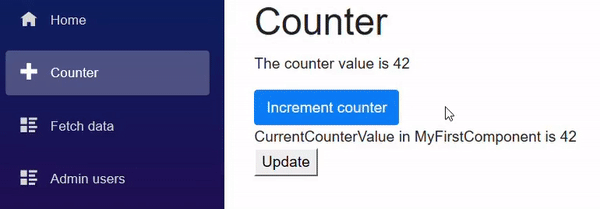

Note: If you've not done so, perform the steps in [One-way binding](/components/one-way-binding/) before continuing with this section.

So far we have a page with an embedded component, and part of our component's state is passed from its host view (the **Counter** page) in the form of a `Parameter` named `CurrentCounterValue`. But what if we also want the component to be able to update the state that is passed into it?

_If you are not already familiar with the `EventCallback<T>` class, read [Component events](https://blazor-university.com/components/component-events/). Ideally, you should also be familiar with using [Component directives](https://blazor-university.com/components/literals-expressions-and-directives/)_, and to gain a deeper understanding of binding variations you may also wish to familiarise yourself with [Browser DOM events](/components/component-events/browser-dom-events/).

Start as we did with the **Counter** page, by adding a button with an `onclick` event that updates the value of `CurrentCounterValue`.

    CurrentCounterValue in MyFirstComponent is @CurrentCounterValue

<button @onclick=UpdateCurrentCounterValue>Update</button>

@code {
    \[Parameter\]
    public int CurrentCounterValue { get; set; }

    void UpdateCurrentCounterValue()
    {
        CurrentCounterValue++;
    }
}

The problem with this is that by default `[Parameter]` bindings are one-way only. So the value of `Page.counter` will be pushed into `MyFirstComponent.CurrentCounterValue` by the fact that the parent view explicitly sets it:

<MyFirstComponent CurrentCounterValue=@currentCount/>

But when the property within **MyFirstComponent** is altered, the component sets its local copy of the state and not the state of its parent view. Not only that, but the next time the parent's state is updated, it will push that value into `MyFirstComponent.CurrentCounterValue` and replace the value we have modified.

## Notifying parent components when state changes

To fix this, we need to tell Blazor that the consuming page wants to use two-way binding. Instead of simply setting the `CurrentCounterValue` we now tell Blazor to bind (i.e. two-way bind) to the value instead. To use two-way binding on a parameter simply prefix the HTML attribute with the text `@bind-`. This tells Blazor it should not only push changes to the component, but should also observe the component for any changes and update its own state accordingly.

<MyFirstComponent @bind-CurrentCounterValue=currentCount/>

**Note**: The `@` symbol is needed when assigning code values (rather than constants) to parameters. Previously our mark-up contained `CurrentCounterValue=@currentCount`, but once we prepend the parameter name with `@bind-` the `@` symbol before `currentCount` becomes unnecessary.

Running the app now will show the following error in the browser's console window.

> WASM: System.InvalidOperationException: Object of type 'TwoWayBinding.Client.Components.MyFirstComponent' does not have a property matching the name 'CurrentCounterValueChanged'.

Two-way binding in Blazor uses a naming convention. If we want to bind to a property named `SomeProperty`, then we need an event call-back named `SomeProperyChanged`. This call-back must be invoked any time the component updates `SomeProperty`.

To implement this in **MyFirstComponent**

1. Add the `CurrentCounterValueChanged` event call-back.
2. Change the `UpdateCurrentCounterValue` method from `void` to `async Task`.
3. After incrementing `CurrentCounterValue` invoke `CurrentCounterValueChanged` to notify the consumer that the state has altered.

    CurrentCounterValue in MyFirstComponent is @CurrentCounterValue

<button @onclick=@UpdateCurrentCounterValue>Update</button>

@code {
    \[Parameter\]
    public int CurrentCounterValue { get; set; }

    \[Parameter\]
    public EventCallback<int> CurrentCounterValueChanged { get; set; }

    async Task UpdateCurrentCounterValue()
    {
        CurrentCounterValue++;
        await CurrentCounterValueChanged.InvokeAsync(CurrentCounterValue);
    }
}

## How it works

If we open the **Counter.razor.gs** file in obj\\Debug\\netstandard2.0\\Razor\\Pages we can see the `BuildRenderTree` method looks like this:

builder.OpenComponent<...MyFirstComponent>(10);

builder.AddAttribute(11, "CurrentCounterValue", 
	...TypeCheck<System.Int32>(
		...BindMethods.GetValue(currentCount)
	)
);

builder.AddAttribute(12, "CurrentCounterValueChanged",
	...TypeCheck<...EventCallback<System.Int32>>(
		...EventCallback.Factory.Create<System.Int32>(
			this,
			...EventCallback.Factory.CreateInferred(
				this,
				\_\_value => currentCount = \_\_value,
				currentCount
			)
		)
	)
);
builder.CloseComponent();

**Note**: The source code has been reformatted, and name spaces replaced with `…` for brevity.

- **Line 5** performs the one-way binding from `Counter.currentCount` into `MyFirstComponent.CurrentCounterValue`.
- **Line 15** updates `Counter.currentCount` whenever `MyFirstComponent.CurrentCounterValueChanged` is executed.

\[menu\_navigator\]
