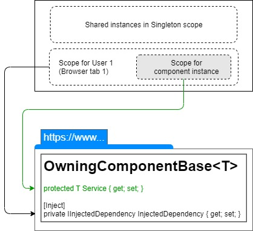

The [OwningComponentBase<T>](https://blazor-university.com/dependency-injection/component-scoped-dependencies/owningcomponentbase-generic/) class is a suitable solution for when we need our component to own only a single isolated instance of a dependency (and any Scoped/Transient dependencies it depends upon). However, sometimes we need our component to own multiple dependencies.

This section will demonstrate the **_wrong_** way to achieve this goal, and then the [following section](https://blazor-university.com/dependency-injection/component-scoped-dependencies/owning-multiple-dependencies-the-right-way/) will demonstrate how to implement it correctly.

## Overview

The thing to remember when using `OwningComponentBase<T>`, is that it is only the `T` (stored in the property named `Service`) that is created within the injection container owned by the component.

Using the `@inject` directive on a descendant of `OwningComponentBase<T>` will not inject the dependency from the component's own injection container.

**Note**: If you have not already done so, read the section on [OwningComponentBase<T>](https://blazor-university.com/dependency-injection/component-scoped-dependencies/owningcomponentbase-generic/) if you are not already familiar with how this class creates its own injection container.

## Example

For this exercise, we'll create a new Blazor application that will demonstrate the different lifetimes of services provided to our component via the `T` in `OwningComponentBase<T>` and the `@inject` directive.

First, create a new project, and add the following service.

public interface IOwnedDependency
{
	public int InstanceNumber { get; }
}

public class OwnedDependency : IDependencyOne
{
	private static volatile int PreviousInstanceNumber;

	public int InstanceNumber { get; }
	public OwnedDependency()
	{
		InstanceNumber =
			System.Threading.Interlocked.Increment(ref PreviousInstanceNumber);
	}
}

The class simply assigns itself a new `InstanceNumber` based on incrementing a `static` field, giving us a sequential number for each instance.

Next, create an identical piece of code using the name `InjectedDependency` and register the services.

// Server-side apps, edit Startup.cs
services.AddScoped<IOwnedDependency, OwnedDependency>();
services.AddScoped<IInjectedDependency, InjectedDependency>();

// WebAssembly apps, edit Program.cs
builder.Services.AddScoped<IOwnedDependency, OwnedDependency>();
builder.Services.AddScoped<IInjectedDependency, InjectedDependency>();

### Consuming the dependencies

Now create a component in the **/Shared** folder named **MyOwningComponent**, like so:

@inherits OwningComponentBase<IOwnedDependency>
@inject IInjectedDependency InjectedDependency

	Service.InstanceNumber = @Service.InstanceNumber

	InjectedDependency.InstanceNumber = @InjectedDependency.InstanceNumber

- **Line 1**  
    Descends our component from `OwningComponentBase<IOwnedDependency>` so our component will create its own injection container and resolve an instance of `IOwnedComponent` from it.
- **Line 2**  
    Uses the standard `@inject` directive to have Blazor inject an instance of `IInjectedDependency` into our component.

### Displaying the result

Finally, we'll edit the **Index.razor** file. We'll create a `boolean` field, and only render `MyOwnedComponent` if that field is true. This will tell Blazor to create an instance of the component when needed, and release it when it is not. We'll `@bind` an HTML checkbox to allow the user to toggle the component.

@page "/"

<input id="show-component" type=checkbox @bind=ShowComponent/>
<label for="show-component">Show component</label>

@if (ShowComponent)
{
	<MyOwningComponent/>
}

@code
{
	bool ShowComponent = false;
}

Running the application and toggling the state of the checkbox will reveal the following.

| Step | Owned service | Injected service |
| --- | --- | --- |
| 1 | InstanceNumber = 1 | InstanceNumber = 1 |
| 2 | InstanceNumber = 2 | InstanceNumber = 1 |
| 3 | InstanceNumber = 3 | InstanceNumber = 1 |

## Conclusion

When using the `@inject` directive, Blazor will inject Scoped dependencies from the dependency container associated with the current user's session (the current browser tab). Only the `T` in `OwnedComponentBase<T>` will be resolved from the injection container that is created and destroyed along with the instance of our `OwningComponentBase<T>` descended component.

The correct way for a component to own multiple dependencies will be covered in the section about the non-generic [OwningComponentBase](https://blazor-university.com/dependency-injection/component-scoped-dependencies/owning-multiple-dependencies-the-right-way/) class.

