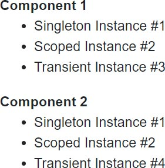
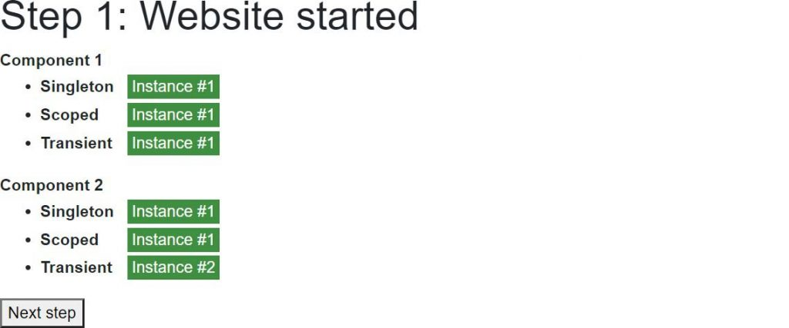
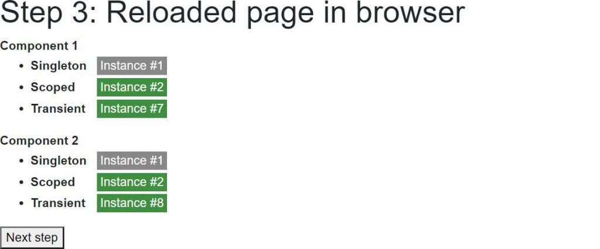
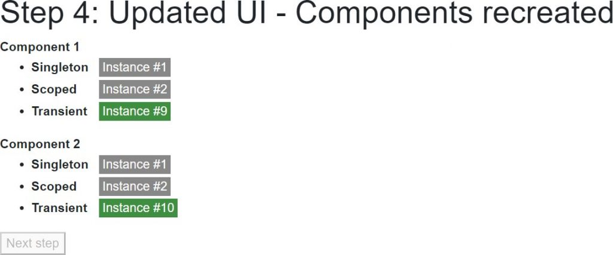
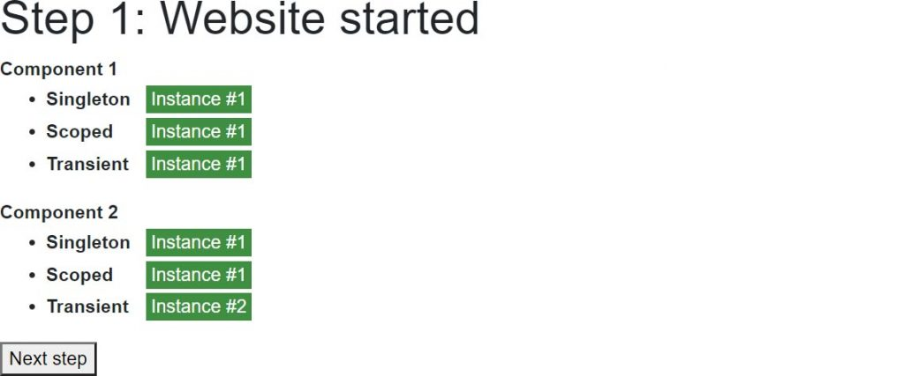
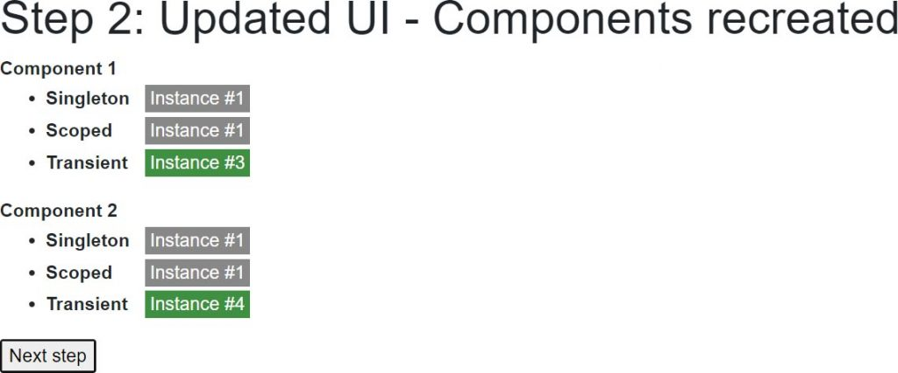
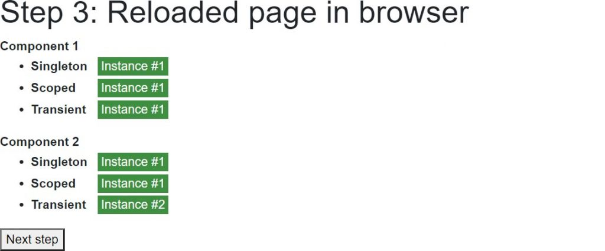
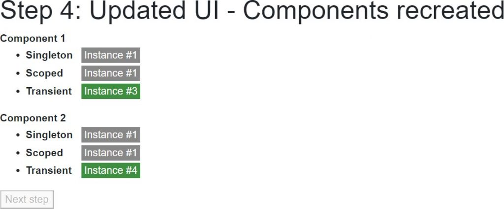

In this section we'll create a Blazor application to demonstrate the different lifetimes of the various dependency injection scopes.

To do this, we'll create three different services (one for each scope). Each of the services will keep track of the time it was created, and an incrementing `InstanceNumber` so we can keep track of how many instances of the type have been created.

First, create a new Blazor server-side application and add a static class to track the DateTime the app started, and calculate how much time has elapsed since it started.

public static class AppLifetime
{
	public static DateTime StartTimeUtc { get; } = DateTime.UtcNow;
	public static TimeSpan ElapsedTime => DateTime.UtcNow - StartTimeUtc;
}

## Service interfaces

Next, create three interfaces: `IMyTransientService`, `IMyScopedService`, and `IMySingletonService`. Each interface will be identical.

**Note:** There are ways to write this code that would not require duplication, but for the sake of simplicity this sample will duplicate code.

public interface IMyTransientService
{
	public TimeSpan DeltaCreationTime { get; }
	public int InstanceNumber { get; }
}

public interface IMyScopedService
{
	// As above
}

public interface IMySingletonService
{
	// As above
}

### Service implementations

Again the code for these services will be duplicated to avoid complexity. Upon creation our service will get the `ElapsedTime` from the `AppLifetime` class, so we can tell if the instance has been created recently or not. It will also assign itself an `InstanceId` from a static field.

public class MyTransientService : IMyTransientService
{
	public TimeSpan DeltaCreationTime { get; }
	public int InstanceNumber { get; }

	private static volatile int PreviousInstanceNumber;

	public MyTransientService()
	{
		DeltaCreationTime = DateTime.UtcNow - AppLifetime.StartTimeUtc;
		InstanceNumber = System.Threading.Interlocked.Increment(ref PreviousInstanceNumber);
	}
}

public class MyScopedService : IMyScopedService
{
	//As above
}

public class MySingletonService : IMySingletonService
{
	// As above
}

### Registering our services

Edit the Startup.cs file, and in the `ConfigureServices` method register our services as follows.

services.AddSingleton<IMySingletonService, MySingletonService>();
services.AddScoped<IMyScopedService, MyScopedService>();
services.AddTransient<IMyTransientService, MyTransientService>();

## User interface

In our page, we'll want to show how instances are shared by multiple components. We'll make this easy by creating a component that consumes all three of our services, and then by having two instances of our component displayed in our page at the same time.

### Creating our service consuming component

First we need to inject our services, then we'll display the `InstanceNumber` for each instance and whether or not the injected service was created recently. To do this, we'll include a CSS class in UI if the service was created within the last 500 milliseconds.

@inject IMySingletonService MySingletonService
@inject IMyScopedService MyScopedService
@inject IMyTransientService MyTransientService
<dl>
	<dt>@Caption</dt>
	<dd>
		<ul>
			<li>
				Singleton
				Instance #@MySingletonService.InstanceNumber
			</li>
			<li>
				Scoped
				Instance #@MyScopedService.InstanceNumber
			</li>
			<li>
				Transient
				Instance #@MyTransientService.InstanceNumber
			</li>
		</ul>
	</dd>
</dl>

@code
{
	[Parameter]
	public string Caption { get; set; }

	private string GetNewIndicatorCss(TimeSpan time)
	{
		if (AppLifetime.ElapsedTime - time < TimeSpan.FromMilliseconds(500))
		{
			return "instance-info new-instance";
		}
		return "instance-info";
	}
}

- **Lines 1-3**  
    Instructs Blazor to inject instances of our services into this component.
- **Lines 10, 14, and 18**  
    Shows the `InstanceNumber` of each of the injected dependencies, and also sets the HTML element's `class` attribute by calling `GetNewIndicatorCss`.
- **Line 31**  
    If the `DeltaCreationTime` (time between app start and instance creation) of the service is within 500 milliseconds of `AppLifetime.ElapsedTime` (time between app start and current time) then the component will be rendered with the CSS classes `instance-info new-instance`, otherwise it will only have the CSS class `instance-info`. This will let us display the UI differently for new instances.

### Displaying our component on a page

Edit Pages/Index.razor and change the mark-up as follows

@page "/"
<MyStandardComponent Caption="Component 1" />
<MyStandardComponent Caption="Component 2" />

Run the application and you'll see the following output.

It might come as a surprise that our Scoped Instance is `#2` when it should be the first instance. This is because server-side Blazor apps pre-render our page to send back a full HTML response before establishing a SignalR connection between browser and server to actually start our user's session. We can disable this for now by doing the following.

- Edit /Pages/\_Host.cshtml
- Locate the text `render-mode="ServerPrerendered"`
- Change `ServerPrerendered` to `Server`

Re-running the app now will give us the result we expect.

The Singleton Instance will always be `#1` as it is shared by all users. The Scoped Instance will be `#1` for the first user of the app, `#2` for the second, and so on. The Transient Instance will be `#1` for the first component, `#2` for the second, because these are created for each component. If the user leaves the page and then returns, the only instance numbers that will change are the Transient Instances which will increment to `#3` and `#4`, and on the next visit to the page will increment to `#5` and `#6`.

## Interactive sample

To make the lifecycles a bit more obvious, we'll modify our Index.razor page so that it conditionall renders our components. We'll also show how an actual page refresh affects our scoped services.

We'll create a simple wizard style UI with the following steps

1. Website started
2. Updated UI - Components recreated
3. Reloaded page in browser
4. Updated UI - Components recreated

### Ensuring components are recreated at each step

To ensure our components are created on each navigation, we'll have a `CurrentStep` field and display one or another set of components depending on if the `CurrentStep` is an odd or even number.

@if (CurrentStep % 2 == 1)
{
	<MyStandardComponent Caption="Component 1" />
	<MyStandardComponent Caption="Component 2" />
}
else
{
	<MyStandardComponent Caption="Component 1" />
	<MyStandardComponent Caption="Component 2" />
}

### Forcing a page refresh in the browser

To force a page refresh we'll use the `NavigationManager` to navigate, and pass `true` to the `forceLoad` parameter. So that we know we are continuing after a page refresh we'll navigate to `/continue`. This request will be served by the same page, but we'll know we should start at step 3 instead of step 1.

@page "/"
@page "/{Continue}"
@inject NavigationManager NavigationManager

@code
{
	[Parameter]
	public string Continue { get; set; }

	private void GoToNextStep()
	{
		CurrentStep++;
		if (CurrentStep == 3)
			NavigationManager.NavigateTo("/continue", forceLoad: true);
	}

	protected override void OnInitialized()
	{
		base.OnInitialized();
		if (!string.IsNullOrWhiteSpace(Continue))
			CurrentStep = 3;
	}
}

### Completing the sample

The following (completed) code is essentially what has been outlined so far, with the addition of the following.

1. Added text showing the name of the current step.
2. Added a button to click in order to progress to the next step.
3. Added code to disable the button when there is no next step.
4. Added some CSS styling in order to make new instances grab our attention by pulsing.

@page "/"
@page "/{Continue}"
@inject NavigationManager NavigationManager

<h1>Step @CurrentStep: @CurrentStepName</h1>
@if (CurrentStep % 2 == 1)
{
	<MyStandardComponent Caption="Component 1" />
	<MyStandardComponent Caption="Component 2" />
}
else
{
	<MyStandardComponent Caption="Component 1" />
	<MyStandardComponent Caption="Component 2" />
}
<button @onclick=GoToNextStep disabled=@IsButtonDisabled>Next step</button>

@code
{
	[Parameter]
	public string Continue { get; set; }

	private int CurrentStep = 1;
	private string CurrentStepName => StepNames\[CurrentStep - 1\];
	private bool IsButtonDisabled => CurrentStep >= StepNames.Length;

	private string\[\] StepNames = new string\[\]
	{
		"Website started",
		"Updated UI - Components recreated",
		"Reloaded page in browser",
		"Updated UI - Components recreated"
	};

	protected override void OnInitialized()
	{
		base.OnInitialized();
		if (!string.IsNullOrWhiteSpace(Continue))
			CurrentStep = 3;
	}

	private void GoToNextStep()
	{
		CurrentStep++;
		if (CurrentStep == 3)
			NavigationManager.NavigateTo("/continue", forceLoad: true);
	}
}

- **Line 6**  
    Renders one set of component instances or another depending on if `CurrentStep` is an odd or even number. This ensures the components that generate the UI are recreated for every step of the wizard.
- **Line 16**  
    Goes to the next step of the wizard, if there is one.
- **Line 69**  
    If the `Continue` route parameter is not null then continue from step 3.
- **Line 76**  
    If the clicks the **Next step** button and ends up on step 3, then force a reload of the page.

## Running the application

When our website first runs, we get the first instance of all of our injected dependencies. Except for the Transient dependencies, because these are created on demand and not cached away for reuse, we are given instances `#1` and `#2`.

When the user clicks the **Next step** button the `CurrentStep` increments to 2, the first couple of our components are discarded and the second couple are created for rendering instead. Because these are new instances running in the same user session, they will receive the same Scoped dependency along with two new Transient dependencies.

When the user clicks the **Next step** button again the app will force a reload of the app at the new path `/continue`. Because the ID of the SignalR connection was forgotten when the page was reloaded, the user will be set up with a new connection and therefore a new scope. So now when the first couple of components are rendered they Scoped instance `#2`.

Finally, when the user clicks the Next step button for the final time, the second couple of our components will be created to be rendered and will be injected with the `IMySingletonService` cached by instance cached in the shared Singleton container (instance `#1`), with the `IMyScopedService` cached by the current user's injection container (instance `#2`), and two new instances of `IMyTransientService`.

## WebAssembly dependency scopes

Because WebAssembly runs in the user's browser and every tab is a completely separate process, our output will be slightly different than that produced by a server-side Blazor application.

First, the app starts up in the browser tab and we get the same output we'd expect to see on a server-side Blazor application.

The first click of **Next step** also shows us a screen that is the same as in our server-side Blazor application, where the Singleton and Scoped instances remain unchanged because they are both cached instances, and two Transient instances are created on demand.

It's when our app performs a forced reload that things are different. In a server-side application the user gets a new SignalR connection ID and therefore a new dependency injection container on the server that is tied to that ID. In WebAssembly there is no application state for the page to reconnect to. Once the page reloads, the whole application state is destroyed and then recreated. As a consequence, our instances numbers start again from the beginning.

And then finally.

## Conclusion

Due to the fact that the user interface and the UI logic are tied together in a Blazor application, there is no per-request dependency injection scope.

Singleton registered dependencies are shared across users in a server-side application, but unique per browser tab in a WebAssembly application.

Scoped dependencies act pretty much the same as Singleton registered dependencies, except they are isolated from other users / other browser tabs.

Transient dependencies work the same on both server-side and WebAssembly, and the same as in ASP.NET MVC - except for the fact that the dependency injection container is disposed of after a page request in ASP.NET MVC. See the [Avoiding memory leaks](https://blazor-university.com/dependency-injection/dependency-lifetimes-and-scopes/transient-dependencies/#avoiding-memory-leaks) section of Transient dependencies.

There are ways of introducing additional scopes for each user. This technique will be covered in a later section.

\[menu\_navigator\]
