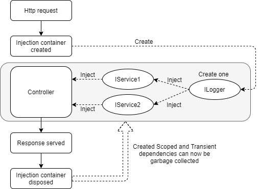
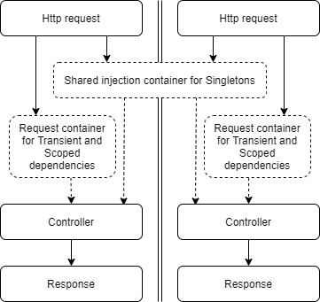
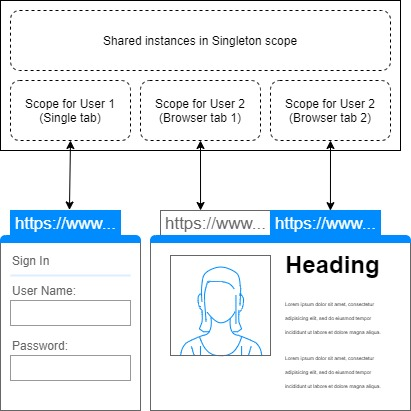

A Scoped dependency is similar to a [Singleton dependency](/dependency-injection/dependency-lifetimes-and-scopes/singleton-dependencies/) in so far as Blazor will inject the same instance into every object that depends upon it, however, the difference is that a Scoped instance is not shared by all users.

In a classic ASP.NET MVC application a new dependency injection container is created per request. The first object that depends on a Scope registered dependency wil receive a new instance of that dependency, and that new instance will be cached away in the injection container.

From there on, any object requesting the same dependency type (such as ILogger in the preceding example) will receive the same cached instance. Then, at the end of the request, the container is no longer needed and may be garbage collected along with all Scoped and Transient registered instances it created.

Scoped instances enable us to register dependencies as single-instance-per-user rather than single-instance-per-application.

## Blazor server-side Scoped dependencies

Unlike ASP.NET MVC applications, there is no per-request scope in Blazor. Being a single-page application (SPA), a Blazor application is created only once and then remains on the user's screen for their whole session.

**Note:** Unlike an ASP.NET site, Blazor server-side apps are not persisted across page refreshes. The Scope of a Blazor server-side app is the SignalR connection between client and server.

During the user's session the URL might change, but the browser doesn't actually navigate anywhere. Instead it simply rebuilds the display based on the current URL. Read the section on [Routing](/routing) if you need to familiarise yourself with how this is done.

In Blazor there is no concept of a "per page" scope, registering a dependency as Scoped in Blazor will result in dependencies that live for the duration of the user's session. Instances of Scoped dependencies will be shared across pages and components for a single user, but not between different users and not across different tabs in the same browser.

## WebAssembly Scoped services

Scopes in WebAssembly applications are slightly different. In a server-side application there is a single process that enables us to share Singleton scoped dependencies across all users of the same server. In WebAssembly, each tab is a unique process. This means that Singleton dependencies are not shared across tabs, even in the same browser, let alone across computers.

\[menu\_navigator\]
