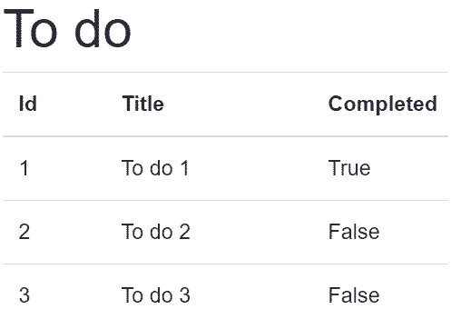

## Defining our dependency

Before we can inject a dependency, we'll need to create one. We'll use the age old ToDo example but, don't worry, we won't be creating a To Do application.

First create a basic `ToDo` class.

public class ToDo
{
	public int Id { get; set; }
	public string Title { get; set; }
	public bool Completed { get; set; }
}

Next, we'll create a class that a Blazor Page or Component might need. In this case it will be an API that retrieves `ToDo` items from a service. We'll not actually call a server, we'll simply return some mock data.

using System.Collections.Generic;
using System.Threading.Tasks;

namespace BasicDependencyInjection
{
	public interface IToDoApi
	{
		Task<IEnumerable<ToDo>> GetToDosAsync();
	}

	public class ToDoApi : IToDoApi
	{
		private readonly IEnumerable<ToDo> Data;

		public ToDoApi()
		{
			Data = new ToDo\[\]
			{
				new ToDo { Id = 1, Title = "To do 1", Completed = true},
				new ToDo { Id = 2, Title = "To do 2", Completed = false},
				new ToDo { Id = 3, Title = "To do 3", Completed = false},
			};
		}

		public Task<IEnumerable<ToDo>> GetToDosAsync() => Task.FromResult(Data);
	}
}

We've abstracted the service by implementing an interface. This is good practice in case we wish to pass a in mock when unit testing our class.

## Registering injectable dependencies

When a Blazor application runs through its start up code, one of the things it does for us is to configure a dependency injection container. The dependency injection container is responsible for building up instances of classes (and instances of their dependencies, and so on).

During this bootstrapping process, we are expected to register which classes we wish to make available as automatically injectable dependencies. We can either register a class itself as injectable, like so:

services.AddSingleton<ToDoApi>();

Or we can register an interface as injectable, as long as we additionally specify the class that implements the interface.

service.AddSingeton<IToDoApi, ToDoApi>();

**Note:** Again, the latter approach is recommended in order to make unit testing more simple. It will also allow the implementing class to be specified in a configuration file - for example, we could specify a different IEmailService depending on if the deployed platform is Development / Test / Production.

Other patterns for registering dependencies are:

// Register an existing object instance
services.AddSingleton(existingObject);

// Register an existing object instance, injected via an interface
services.AddSingleton<ISomeInterface>(implementingInstance);

// Lazy created instance, with manual build process and access to the current IServiceProvider
services.AddSingleton<ISomeInterface>(serviceProvider => new ImplementingType(.......));

The bootstrapping code is not identical in Blazor Server and Blazor WASM applications so, although the service registration is the same, where we have to go to register our injectable dependencies is slightly different.

### Registering injectables in a Blazor Server app

In a Blazor Server app there is a `Startup` class with a `ConfigureServices` method. This is where we are expected to perform our registrations.

public void ConfigureServices(IServiceCollection services)
{
	... default Blazor registrations omitted ...
	// Register our own injectables
	services.AddSingleton<IToDoApi, ToDoApi>();
}

This is the same for WASM applications when we check the ASP.NET Core hosted checkbox when creating our application. This is because the server is responsible for bootstrapping the whole application.

### Registering injectables in a Blazor WASM app

When our Blazor project is a stand-alone WASM application (not ASP.NET Core hosted), the application must have its own bootstrapper class. In this type of application, the class is named `Program`, and the bootstrapping method is named `Main` - just as it is in a Console application.

public static async Task Main(string\[\] args)
{
	var builder = WebAssemblyHostBuilder.CreateDefault(args);
	builder.RootComponents.Add<App>("app");

	builder.Services.AddTransient(sp => new HttpClient { BaseAddress = new Uri(builder.HostEnvironment.BaseAddress) });

	// Register our own injectables
	builder.Services.AddSingleton<IToDoApi, ToDoApi>();

	await builder.Build().RunAsync();
}

## Injecting dependencies

For non-Blazor classes, such as other injectable services, dependencies may be injected via the class's constructor.

public class NewsletterService : INewsletterService
{
	private readonly IEmailService EmailService;

	public NewsletterService(IEmailService emailService)
	{
		EmailService = emailService;
	}
}

This, however, is not the case for Blazor components. At the moment, constructor injection is not supported. There are two ways we can indicate which dependencies our component consumes; one in Razor mark-up, and one in C# code.

@inject IToDoApi ToDoApi
@inject ISomeServiceType AnotherService

@code
{
	\[Inject\]
	private IYetAnotherServiceType PropertyInjectedDependency { get; set; }
}

The [InjectAttribute](https://docs.microsoft.com/en-us/dotnet/api/microsoft.aspnetcore.components.injectattribute) may only be applied to a property that has a property setter, the encapsulation level of the property is irrelevant.

**Note:** These two approaches are identical. In fact, the `@inject` syntax is simply shorthand for the `[Inject]` syntax. When building our app, Blazor will first transpile or Razor markup into C# source code. To see how the `@inject` syntax is transpiled, open the folder **\\obj\\Debug\\netcoreapp3.1\\Razor** and look for the `.cs` file corresponding to the razor file.

## Consuming injected dependencies

Dependencies are injected after the Blazor component instance has been created and before the `OnInitialized` or `OnInitializedAsync` [lifecycle events](https://blazor-university.com/components/component-lifecycles/) are executed. This means we cannot override our component's constructor and use those dependencies from there, but we can use them in the `OnInitialized*` methods.

To consume our `IToDoApi` service, we'll simply inject it into our `Index` page using the `@inject` syntax and then call it when our page initialises.

@page "/"
@inject IToDoApi ToDoApi

<h1>To do</h1>
@if (Data.Any())
{
	<table class="table">
		<thead>
			<tr>
				<th>Id</th>
				<th>Title</th>
				<th>Completed</th>
			</tr>
		</thead>
		<tbody>
			@foreach (ToDo item in Data)
			{
				<tr>
					<td>@item.Id</td>
					<td>@item.Title</td>
					<td>@item.Completed</td>
				</tr>
			}
		</tbody>
	</table>
}

@code
{
  private IEnumerable<ToDo> Data = Array.Empty<ToDo>();

  protected override async Task OnInitializedAsync()
  {
	  await base.OnInitializedAsync();
	  Data = await ToDoApi.GetToDosAsync();
  }
}

- **Line 2**  
    An instance of `IToDoApp` is injected into our page, we use the name **ToDoApi** to reference the injected dependency.
- **Line 35**  
    The `GetDoToAsync` method is called on the injected service. The method is awaited and the result stored in **Data**.
- **Lines 16-23**  
    The items in **Data** are iterated over using a `@foreach` loop, and the output rendered as part of our view.

