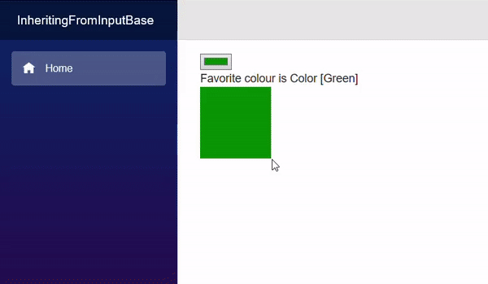

The `InputBase<T>` component is the abstract class the various Blazor input controls descend from. This class adds additional functionality above that of standard HTML `<input>` elements, such as validation - which we'll cover later. Because of this, it is recommended we descend components from this base class if we intend them to act as user input.

Implementing `InputBase<T>` is simply a case of implementing one abstract method, and optionally one virtual method.

`InputBase<T>` is a generic class that has a property of type `T` named `Value`. Because web browsers work with string values, this component needs a way to convert a value of type `T` to and from a string.

protected abstract bool TryParseValueFromString(string value, out T result, out string validationErrorMessage);

`TryParseValueFromString` is an abstract method that should be overridden in order to convert a string value from an HTML `<input>` element (or other source that works with strings) into the target type `T`. If the conversion is not possible, the `validationErrorMessage` should be set to a suitable message to indicate the conversion failed. This is used to provide a validation error message along with a visual invalid state so the user is aware the attempt to set the value failed.

protected virtual string FormatValueAsString(T value)

`FormatValueAsString` is the inverse of `TryParseValueFromString`. In cases where a simple `Value.ToString()` is not sufficient to translate a value of `T` back into the browser UI layer, this method should be overridden to perform the task correctly.

## Creating an InputColor component

First we need to create an **InputColor.razor** file. Within that file we need to specify `InputBase<Color>` as a base class, and also add the mark-up we want rendered in our HTML.

@using System.Drawing
@using System.Text.RegularExpressions
@inherits InputBase<Color>

<input type="color" @attributes=AdditionalAttributes class=@CssClass @bind=CurrentValueAsString/>

`System.Drawing` was added for the `Color` class, and `System.Text.RegularExpressions` was added for parsing input from a hex code into a `Color` value.

The first thing we'll do is implement `FormatValueAsString`. To achieve this we'll simply format the R, G, and B values as 2 digit hex values.

protected override string FormatValueAsString(Color value)
	=> $"#{value.R:x2}{value.G:x2}{value.B:x2}";

To convert a hex string back to a `Color` we'll first need to convert a 2 character hex value into a `byte`.

byte HexStringToByte(string hex)
{
	const string HexChars = "0123456789abcdef";

	hex = hex.ToLowerInvariant();
	int result = (HexChars.IndexOf(hex\[0\]) \* 16) + HexChars.IndexOf(hex\[1\]);
	return (byte)result;
}

Next we'll need to implement `TryParseValueAsString`.

static Regex Regex = new Regex("^#(\[0-9a-f\]{2}){3}$", RegexOptions.Compiled | RegexOptions.IgnoreCase);

protected override bool TryParseValueFromString(string value, out Color result, out string validationErrorMessage)
{
	Match match = Regex.Match(value);
	if (!match.Success)
	{
		validationErrorMessage = "Not a valid color code";
		result = Color.Red;
		return false;
	}

	byte r = HexStringToByte(match.Groups\[1\].Captures\[0\].Value);
	byte g = HexStringToByte(match.Groups\[1\].Captures\[1\].Value);
	byte b = HexStringToByte(match.Groups\[1\].Captures\[2\].Value);

	validationErrorMessage = null;
	result = Color.FromArgb(r, g, b);
	return true;
}

The code uses a regular expression to ensure the value is a string in a format of 6 hex characters, preceded with a `#` character. It captures the three groups of 2 digit hex characters and uses our `HexStringToByte` method to convert them into bytes. Finally, a `Color` is created using those RGB values.

Because us British like the word colour to be spelled correctly, we should really add a parameter to the component to allow its consumer to specify a custom error message to use when the value passed is invalid. Add a `[Parameter]` property. It may be called whatever we wish, but **ParsingErrorMessage** is the standard name used in Blazor.

\[Parameter\]
public string ParsingErrorMessage { get; set; }

And then change the code that sets the `validationErrorMessage` in our `TryParseValueFromString` method to use that parameter instead of our hard-coded error message.

if (!match.Success)
{
	validationErrorMessage = ParsingErrorMessage;
	result = Color.Red;
	return false;
}

For the sake of making it easy to display our colour as text, let's refactor our `FormatValueAsString` method to use a static method, so we can use that static method independently of any instance of `InputColor`.

public static string ColorToString(Color value)
	=> $"#{value.R:x2}{value.G:x2}{value.B:x2}";

protected override string FormatValueAsString(Color value)
	=> ColorToString(value);

Our entire component should now look like this:

@using System.Drawing
@using System.Text.RegularExpressions
@inherits InputBase<Color>

<input type="color" @attributes=AdditionalAttributes class=@CssClass @bind=CurrentValueAsString/>

@code {
	\[Parameter\] public string ParsingErrorMessage { get; set; }

	public static string ColorToString(Color value)
		=> $"#{value.R:x2}{value.G:x2}{value.B:x2}";

	protected override string FormatValueAsString(Color value)
		=> ColorToString(value);

	static Regex Regex = new Regex("^#(\[0-9a-f\]{2}){3}$", RegexOptions.Compiled | RegexOptions.IgnoreCase);
	protected override bool TryParseValueFromString(string value, out Color result, out string validationErrorMessage)
	{
		Match match = Regex.Match(value);
		if (!match.Success)
		{
			validationErrorMessage = ParsingErrorMessage;
			result = Color.Red;
			return false;
		}

		byte r = HexStringToByte(match.Groups\[1\].Captures\[0\].Value);
		byte g = HexStringToByte(match.Groups\[1\].Captures\[1\].Value);
		byte b = HexStringToByte(match.Groups\[1\].Captures\[2\].Value);

		validationErrorMessage = null;
		result = Color.FromArgb(r, g, b);
		return true;
	}

	byte HexStringToByte(string hex)
	{
		const string HexChars = "0123456789abcdef";

		hex = hex.ToLowerInvariant();
		int result = (HexChars.IndexOf(hex\[0\]) \* 16) + HexChars.IndexOf(hex\[1\]);
		return (byte)result;
	}
}

## InputColor example

We'll make a simple page that let's the user choose a person's favourite colour.

@page "/"
@using System.Drawing

<EditForm Model=CurrentPerson>
	<InputColor @bind-Value=CurrentPerson.FavoriteColor/>
</EditForm>

Favorite colour is @CurrentPerson.FavoriteColor

@code {
	Person CurrentPerson = new Person
	{
		FavoriteColor = Color.Green
	};

	string ColorAsHex => InputColor.ColorToString(CurrentPerson.FavoriteColor);

	class Person
	{
		public Color FavoriteColor { get; set; }
	}
}

- **Lines 19-22**  
    Create a class to which our `EditForm` will bind.
- **Lines 12-15**  
    Create an instance of this class.
- **Line 17**  
    Uses our static `InputColor.ColorToString` to convert the chosen colour to a web hex colour string.
- **Line 9**  
    Creates a `
` element with inline style that will show the selected colour as a solid box.
- **Line 4**  
    Creates the `EditForm` with its `Model` bound to our page's `Person`.
- **Line 5**  
    Uses our `InputColor` component which will render an HTML `<input>` element with `type=color` for the user to interact with.

\[menu\_navigator\]
