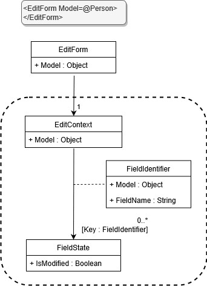
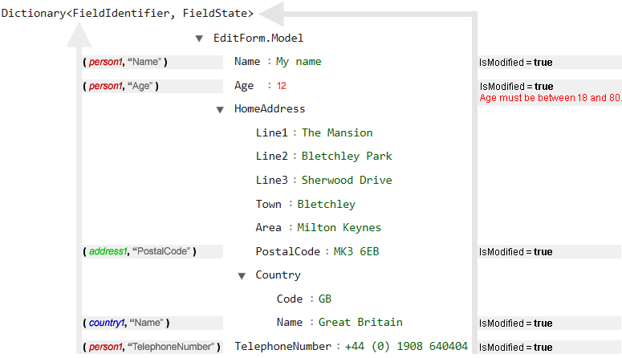

Note that this is an advanced topic for those who wish to know how Blazor works "under the hood". There is no real need to know this information in order to use Blazor on a daily basis - but I feel that knowing the innards can be beneficial.

Let's start with a UML diagram describing how Blazor maintains meta-state for form data.

## EditContext

Whenever the `EditForm.Model` changes (the object being modified in the form), `EditForm.OnParametersSet` is executed and creates a new `EditContext` instance. The `EditForm` component declares this `EditContext` as a [Cascading value](http://blazor-university.com/components/cascading-values/cascading-values-by-type/), so that any components within the form have access to it.

The `EditContext` is a form-meta-data holder for the object currently being edited. When editing an object - such as a `Person` - in a form, Blazor needs to know additional information about that object in order to give a richer user experience. The additional information held by Blazor tells us:

- If a specific property of the model has been manually altered.
- Which model properties have validation errors, and what those errors are.

Clearly, the class of the model being edited should only represent our specific business needs, so having our model classes implement this additional user-interface state information would be a conflict of concerns - so Blazor stores this additional information itself within the EditContext. This is why the EditForm creates a new EditContext whenever its Model changes, because if the Model changes then the information held in the EditContext is no longer relevant.

## FieldIdentifier

The purpose of a `FieldIdentifier` is to provide an identity for a specific property on an object. It differs from `System.Reflection.PropertyInfo` because it identifies a property on a specific object instance, whereas reflection identifies a property on a class.

Given an `Address` class with a property named `PostalCode`, we can expect the following equality rules:

<table><tbody><tr><td><strong>Values</strong></td><td><strong>Equal?</strong></td></tr><tr><td><b><strong>// Reflection</strong></b><strong>: Same property on difference instances</strong> <em>address1.GetProperty("PostalCode"); address2.GetProperty("PostalCode");</em></td><td><code>true</code></td></tr><tr><td><strong>// FieldIdentifier: Same property on same instance</strong> new FieldIdentifier(address1, "PostalCode"); new FieldIdentifier(address1, "PostalCode");</td><td><code>true</code></td></tr><tr><td><strong>// FieldIdentifier: Same property on different instances</strong> new FieldIdentifier(address1, "PostalCode"); new FieldIdentifier(address2, "PostalCode");</td><td><code>false</code></td></tr></tbody></table>

When UI state, such as validation errors, needs to be tied to an input value we need some way of identifying which input data the state relates to. In previous web technologies the individual input was often identified using a string, here are some examples:

- EmailAddress
- HomeAddress.PostalCode
- WorkAddress.PostalCode

These paths could be quite complex once user interfaces became complicated.

- Contacts\[0\].Name
- Contacts\[0\].ContactDetails\[0\].TelephoneNumber
- Contacts\[0\].ContactDetails\[0\].EmailAddress
- Contacts\[9\].ContactDetails\[3\].TelephoneNumber

Blazor simplifies this process because it has been designed in a way that allows it to always work with object and property identities within the same process. This provides us with the ability to identify any property of any object by storing two simple pieces of information.

1. A direct reference to the object itself.
2. The name of the property on that object.

Identities are now simple, and (unlike with string paths) never have to be altered to account for changes to the data such as removing an item from an array. For example, in a string path approach `Contacts[9].ContactDetails[3].TelephoneNumber` would need to be changed to `Contacts[8].ContactDetails[3].TelephoneNumber` if the first contact in the list were to be removed. Blazor's ObjectReference/PropertyName approach avoids this complexity.

Even when we write our own custom validators that talk to a server to determine validity (such as availability of a unique value such as EmailAddress), our Blazor validators will be given an instance of `FieldIdentifier` and the result from the server call could then be associated directly with the correct property of the correct object instance.

## FieldState

The `FieldState` class holds additional information about any object's property. The `EditContext` class has a private property of type `Dictionary<FieldIdentifier, FieldState>` - this lets Blazor store its additional state in a flattened list for quick access.

Given the following model

protected override OnInitialized()
{
	var country1 = new Country
	{
		Code = "GB",
		Name = "Great Britain"
	};
	
	var address1 = new Address
	{
		Line1 = "The Mansion",
		Line2 = "Bletchley Park",
		Line3 = "Sherwood Drive",
		Town = "Bletchley",
		Area = "Milton Keynes",
		PostalCode = "MK3 6EB",
		Country = country1
	};
	
	var person1 = new Person
	{
		Name = "My name",
		Age = 12,
		HomeAddress = address1,
		TelephoneNumber = "+44 (0) 1908 64004"
	};
}

We'd expect to see field identifiers like the following:

**Note**: An entry is only added to the dictionary when needed.

\[menu\_navigator\]
