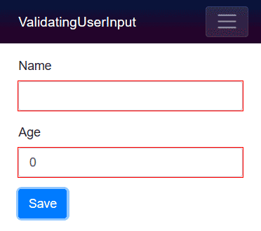
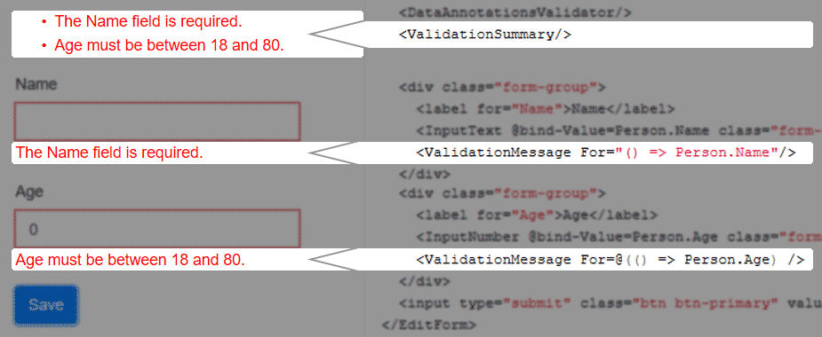

The `DataAnnotationsValidator` is the standard validator type in Blazor. Adding this component within an `EditForm` component will enable form validation based on .NET attributes descended from `System.ComponentModel.DataAnnotations.ValidationAttribute`.

First we'll create a short example, then we'll go through what happens behind the scenes. First, create a model we can edit, and decorate its properties with some data annotations for validation.

public class Person
{
	\[Required\]
	public string Name { get; set; }
	\[Range(18, 80, ErrorMessage = "Age must be between 18 and 80.")\]
	public int Age { get; set; }
}

- Line 3 specifies the `Name` property cannot be null or empty.
- Line 5 specifies a valid range of values for the `Age` property (from 18 to 80) and also provides a suitable error message to display to the user.

## Adding validation

Edit the **Index.razor** page in a default Blazor app and provide some mark-up to edit an instance of `Person`.

<EditForm Model=@Person>
	

		<label for="Name">Name</label>
		<InputText @bind-Value=Person.Name class="form-control" id="Name" />
	

	

		<label for="Age">Age</label>
		<InputNumber @bind-Value=Person.Age class="form-control" id="Age" />
	

	<input type="submit" class="btn btn-primary" value="Save"/>
</EditForm>

@code {
	Person Person = new Person();
}

Running the app now will result in the user being presented with a form that does not validate their input. To ensure the form is validated we must specify a validation mechanism. Add a `DataAnnotationsValidator` component inside the `EditForm` component.

<EditForm Model=@Person>
	<DataAnnotationsValidator/>
	

		<label for="Name">Name</label>
		<InputText @bind-Value=Person.Name class="form-control" id="Name" />
	

	

		<label for="Age">Age</label>
		<InputNumber @bind-Value=Person.Age class="form-control" id="Age" />
	

	<input type="submit" class="btn btn-primary" value="Save"/>
</EditForm>

Running the app and clicking the **Save** button will update the user interface to provide a visual indication that there are errors in the user's input.

## Displaying validation error messages

Validation error messages can be displayed to the user in two ways. We can add a `ValidationSummary` to show a comprehensive list of all errors in the form. We can also use the `ValidationMessage` component to display error messages for a specific input on the form. These components are not mutually exclusive, so it is possible to use both at the same time.

The `ValidationSummary` component can simply be dropped into an `EditForm` in our mark-up; no additional parameters are required at all.

As the `ValidationMessage` component displays error messages for a single field, it requires us to specify the identity of the field. To ensure our parameter's value stays correct after refactoring (for example, when we refactor property names on our `Person` class) Blazor requires us to specify an `Expression` when identifying the field. The parameter, named `For`, is defined on the `ValidationMessage` as follows:

[Parameter]
public Expression<Func<T>> For { get; set; }

This means to specify the identity of the field we should use a lambda expression, which can be presented either "quoted", or wrapped in `@(...)`

- Quoted form  
    `<ValidationMessage For="() => Person.Name"/>`
- Razor expression form  
    `<ValidationMessage For=@( () => Person.Name )/>`

Both forms are equivalent. The quoted form is easier to read, whereas the razor expression makes it more obvious to other developers that we are defining an expression rather than a string.

@page "/"
@using Models

<EditForm Model=@Person>
	<DataAnnotationsValidator/>
	<ValidationSummary/>
	

		<label for="Name">Name</label>
		<InputText @bind-Value=Person.Name class="form-control" id="Name" />
		<ValidationMessage For="() => Person.Name"/>
	

	

		<label for="Age">Age</label>
		<InputNumber @bind-Value=Person.Age class="form-control" id="Age" />
		<ValidationMessage For=@(() => Person.Age) />
	

	<input type="submit" class="btn btn-primary" value="Save"/>
</EditForm>

@code {
	Person Person = new Person();
}

