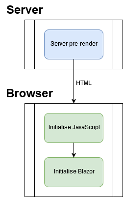

As well as invoking methods on .NET object instances, Blazor also enables us to invoke static methods. The next example will show how to call into .NET from JavaScript and retrieve a specific setting it might need for an API call - for example, for Google Analytics.

The benefit of reading JavaScript settings from the server's settings is that the values can be overridden depending on the environment (Development/ QA / Production) as part of the deployment process without having to alter JavaScript files.

**Warning:** Do not be tempted to create a JavaScript invokable method that will return just any old value from the config as this could result in the client being able to access sensitive information such as security keys.

- Create a new Blazor server-side application
- Open the **/appsettings.json** file and add a section named "JavaScript"

{
	"Logging": {
		"LogLevel": {
			"Default": "Information",
			"Microsoft": "Warning",
			"Microsoft.Hosting.Lifetime": "Information"
		}
	},
	"JavaScript": {
		"SomeApiKey":  "123456789"
	},
	"AllowedHosts": "\*"
}

- Next we need a class to hold this setting, create a folder named **Configuration**
- Within that folder, create a file named **JavaScriptSettings.cs**

public class JavaScriptSettings
{
	public string SomeApiKey { get; set; }
}

- Edit the **/Startup.cs** file
- In the constructor for the class we'll use the injected `IConfiguration` instance to grab the "JavaScript" section from **/appsettings.json** and store it in a static reference.

public Startup(IConfiguration configuration)
{
	Configuration = configuration;
	var javaScriptSettings = configuration
		.GetSection("JavaScript")
		.Get<JavaScriptSettings>();
	JavaScriptConfiguration.SetSettings(javaScriptSettings);
}

- The **JavaScriptConfiguration** class doesn't yet exist, so next we'll create that in the **Configuration** folder.

public static class JavaScriptConfiguration
{
	private static JavaScriptSettings Settings;

	internal static void SetSettings(JavaScriptSettings settings)
	{
		Settings = settings;
	}

	public static JavaScriptSettings GetSettings() => Settings;
}

We now have some new settings in our config file, a class to represent those settings in .NET, and we are reading those values and storing them away in a static reference. Next we need to access it from JavaScript.

- Edit the /Pages/\_Host.cshtml file and beneath the existing `

- Next, create a folder named **scripts** under the **/wwwroot** folder
- Within that folder, create a new file named **CallingDotNetStaticMethods.js** and add the following script

setTimeout(async function () {
	const settings = await DotNet.invokeMethodAsync("CallingStaticDotNetMethods", "GetSettings");
	alert('API key: ' + settings.someApiKey);
}, 1000);

`DotNet.invokeMethodAsync` takes a minimum of two parameters. It is possible to pass more than two, and any parameters after the second are considered values to pass to the method as its parameters.

1. The full name (excluding file extension) of the binary in which the method exists
2. The identifier of the method to execute

The final piece of the puzzle is to decorate the method with the `[JSInvokable]` attribute, passing in the identifier - in this case the identifier will be `GetSettings`.

Edit the **/Configuration/JavaScriptConfiguration** class, and change the GetSettings method:

\[JSInvokable("GetSettings")\]
public static JavaScriptSettings GetSettings() => Settings;

The identifier passed to `[JSInvokable]` does not have to be the same as the method name.

## Qualifying methods for JavaScript invocation

To qualify as a candidate .NET method to be invokable in this way, the method must meet the following criteria:

1. The class owning the method must be public
2. The method must be public
3. It must be a static method
4. The return type must be void, or serializable to JSON - or it must be `Task` or `Task<T>` where T is serializable to JSON
5. All parameters must be serializable to JSON
6. The method must be decorated with `[JSInvokable]`
7. The same `identifier` used in the `JSInvokable` attribute cannot be used within a single assembly more than once.

**Note: Do not immediately invoke .NET static methods from JavaScript**

If you read back to the section on [The JavaScript boot process](/javascript-interop/javascript-boot-process/), you'll remember that JavaScript is initialised in the browser before Blazor has been initialised.

It is for this reason we are only invoking the .NET static method after an initial timeout - in this case I have chosen one second.

setTimeout(async function () {
	const settings = await DotNet.invokeMethodAsync("CallingStaticDotNetMethods", "GetSettings");
	alert('API key: ' + settings.someApiKey);
}, 1000);

At the time of writing there is no way to check from JavaScript whether or not Blazor is ready to be invoked without trying to invoking it and failing.

window.someInitialization = async function () {
	try {
		const settings = await DotNet.invokeMethodAsync("CallingStaticDotNetMethods", "GetSettings");
		alert('API key: ' + settings.someApiKey);
	}
	catch {
		// Try again
		this.setTimeout(someInitialization, 10);
	}
}
window.someInitialization();

## Hooking into Blazor.start

It is possible to have our JavaScript invoked at the point Blazor has been initialised by calling the `Blazor.start` function.

First, edit /Pages/\_Host.cshtml and change the `

Next we need to change our JavaScript so that it calls `Blazor.start` - which will return a `Promise<void>` we can use to execute our own code once Blazor has been initialized.

Blazor.start({})
	.then(async function () {
		const settings = await DotNet.invokeMethodAsync("CallingStaticDotNetMethods", "GetSettings");
		alert('API key: ' + settings.someApiKey);
	});

The problem with this approach is that you can only use it once. So if we have multiple entry points across different scripts then we'll have to create our own hook point that caches the result from `Blazor.start` and returns it to any calling scripts. I have raised a feature request to provide the ability to register multiple callbacks for when Blazor initialization has completed - [here](https://github.com/aspnet/AspNetCore/issues/17504).

\[menu\_navigator\]
