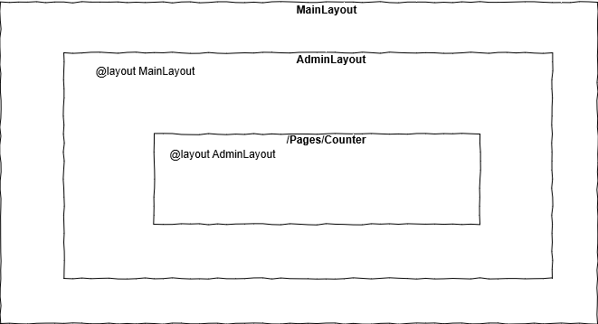

When specifying a `@layout` (either explicitly or through a **\_Imports.razor** file), Blazor will decorate the generated target class with a `LayoutAttribute`.

\[Microsoft.AspNetCore.Components.LayoutAttribute(typeof(MainLayout))\]
public class AdminUsers : Microsoft.AspNetCore.Components.ComponentBase
{
}

**Note**: Generated `.cs` files can be found in the obj\\Debug\\netstandard2.0\\Razor\\ folder of your project.

Blazor will honour a `LayoutAttribute` on any `ComponentBase` descendant. Not only do pages descend from this class, but the `LayoutComponentBase` does too! This means that a custom layout can also have its own parent layout.

Next we'll create a custom layout for the

1. Edit the **/Shared/AdminLayout.razor** file.
2. Explicitly state it uses the **MainLayout** as its parent by adding `@layout MainLayout`.

@inherits LayoutComponentBase
@layout MainLayout

<h1>Admin</h1>
@Body

First we descend our view from `LayoutComponentBase`, then we tell Blazor that we want this layout to be contained within the **MainLayout** Razor view, and finally we render any content declared by a consuming view by outputting the contents of the `Body` property.

In order to ensure the **AdminUsers** page uses the **AdminLayout**, ensure there is no explicit `@layout` at the top of the **AdminUsers.razor** file. This will tell Blazor to use the layout specified in **Pages/Admin/\_Imports.razor**.

@page "/admin/users"

<h2>Users</h2>

\[menu\_navigator\]
