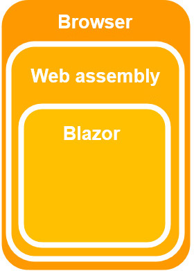
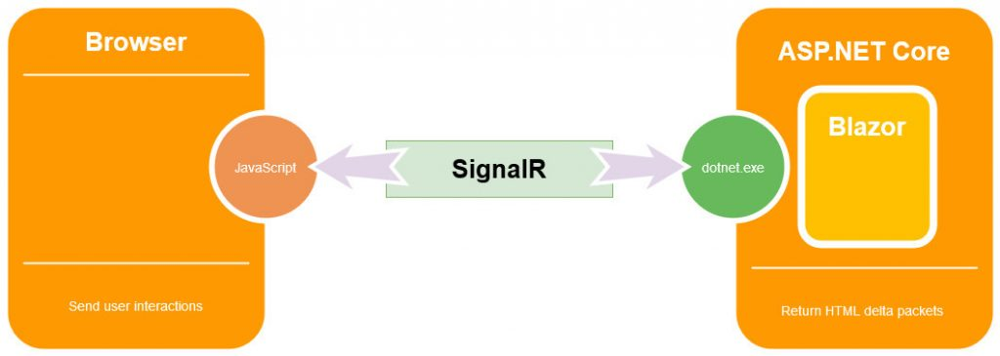
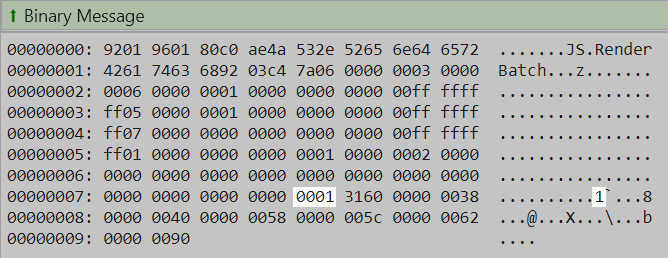

Blazor currently has two hosting models, server-side Blazor and Web Assembly. Server-side hosting was released in September 2019, and Web Assembly was officially released in May, 2020.

## Blazor Web Assembly

### Pros

Web Assembly runs on the client, inside the browser, so it can be deployed as static files. Despite this, Blazor Wasm apps will not run directly from the local file system due to browser security restrictions.

Blazor Wasm can work off-line. When the network connection to the server is lost, the client app can continue to function (obviously it won't be able to talk to the server to retrieve new data).

It can also quite easily run as a [Progressive Web App](https://web.dev/progressive-web-apps/), which means the client can choose to install our app onto their device and run it whenever they wish without any network access at all.

With code running on the client's machine it means the server load is significantly reduced.

### Cons

The `blazor.webassembly.js` file bootstraps the client application. It downloads all required .NET DLL assemblies, which makes the start-up time of the application slower than server-side the first time your app is run (DLLs are then cached by the browser, making subsequent start-up times much faster).

The Mono Framework interprets .NET Intermediate Language so is slower than running server-side Blazor. Ahead-of-time (AOT) compilation is planned for a future release.

Blazor Wasm does not yet support more than a single thread, so all processing occurs on the UI thread - although calls to servers / JavaScript etc occur asynchronously, so do not block the UI's responsiveness.

Additionally, Blazor Wasm only works on newer browsers and is not search-engine friendly (unless we enable server-side pre-rendering).

## Blazor server-side

### Pros

Blazor server-side pre-renders HTML content before it is sent to the client's browser. This makes it search-engine friendly, and there is no perceivable start-up time.

Blazor server-side apps will work on older browsers (such as Internet Explorer 11) as there is no requirement for Web Assembly, only HTML and JavaScript. As the code executes on the server, it is also possible to debug our .NET code in Visual Studio.

### Cons

Blazor server-side sets up an in-memory session for the current client and uses SignalR to communicate between the .NET running on the server and the client's browser. All memory and CPU usage comes at a cost to the server, for all users. It also means that the client is tied to the server that first served it, so doesn't work with load-balancing.

Once the initial page has been rendered and sent to the browser, the `blazor.server.js` file hooks into any relevant user interaction events in the browser so it can mediate between the user and the server. For example, if a rendered element has an `@onclick` event registered, `blazor.server.js` will hook into its JavaScript `onclick` event and then use its SignalR connection to send that event to the server and execute the relevant .NET code.

  Current count = @CurrentCount

<button @onclick=IncrementCount>Click me</button>

@code
{
  private int CurrentCount;

  public void Increment()
  {
    CurrentCount++;
  }
}

After the .NET code has finished, Blazor will re-render the components on the page and then send a delta package of HTML back to the client's browser so it can update its display without having to reload the entire page.

**Note:** [Render trees](/components/render-trees/) are covered in depth later.

If we run a standard Blazor app, click the **Counter** link in the menu, and then click the **Click me** button we can observe the SignalR data communication to and from the server.

1. Run the app in the Chrome browser.
2. Click the **Counter** link in the app's menu.
3. Press F12 to open the browser's Developer tools.
4. In the developer tools window, click the **Network** tab.
5. Reload the page.
6. Next, click the **WS** tab (short for WebSocket).  
    
7. Click on the **\_blazor** item to show socket data.
8. Clicking the **Click me** button will show network traffic something like the following (abridged and formatted for easy reading).

DispatchBrowserEvent
  {
    "browserRendererId": 0,
    "eventHandlerId": 3,
    "eventArgsType": "mouse",
    "eventFieldInfo": null
  }
  {
    "type": "click",
    "detail": 1,
    "screenX": 338,
    "screenY": 211,
    "clientX": 338,
    "clientY": 109,
    "button": 0,
    "buttons": 0,
    "ctrlKey": false,
    "shiftKey": false,
    "altKey": false,
    "metaKey": false
  }

Which results in a response from the server that looks something like the following:

**Note:** The highlighted `1` indicates the delta HTML, and is the new value for the counter.

This round-trip can provide a sluggish experience if the client's browser and the server are not close or the network connection between them is slow, especially when the events triggering state change are frequent. For example, an event such as `onmousemove` will fire very often.

Additionally, changes that require large HTML delta updates can also be slow. For example, if we were to have an HTML `<textarea>` component in our page that updated an area of the display to preview the user's input as they type, the delta HTML from the server would increase with each character added to the `<textarea>`. When the input content becomes large, it results in a large network transfer for every keypress.

Unlike Blazor Wasm, once the connection from the browser to the server is lost the app becomes unresponsive. Blazor will try to re-establish a connection to the server but, until it succeeds, the app shows the message "Attempting to reconnect to the server..." and prevents all mouse interaction with the user-interface.

## Blazor Mobile Bindings

In January 2020, Microsoft announced Blazor Mobile Bindings, an experimental project that allows developers to build native mobile apps using a combination of Blazor and a Razor variant of Xamarin.Forms (XAML).

You can find the official announcement [here](https://devblogs.microsoft.com/aspnet/mobile-blazor-bindings-experiment/).

\[menu\_navigator\]
