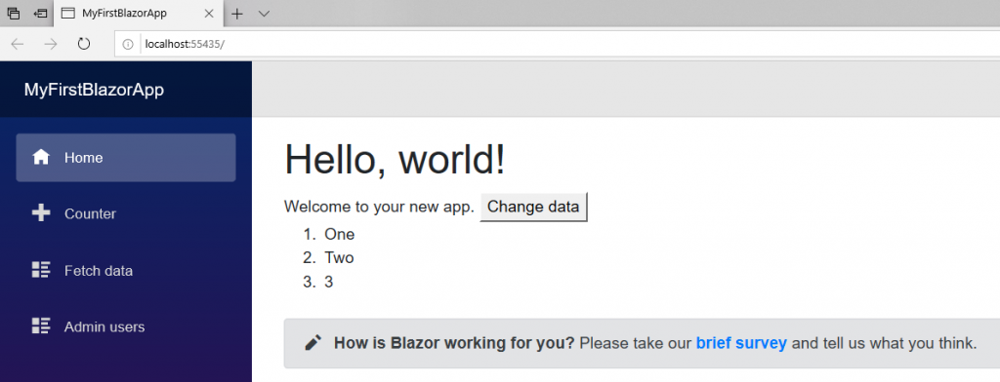
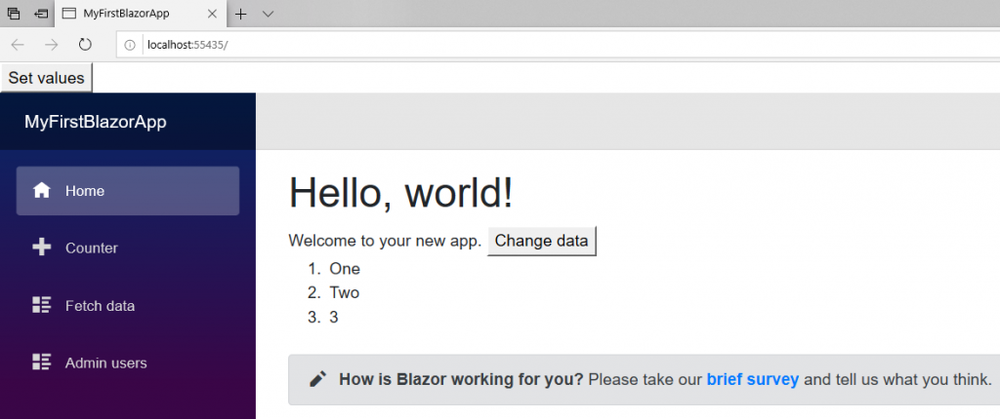

To prove Blazor updates existing browser DOM elements we’ll create some JavaScript that will take Blazor generated elements and update them in a way Blazor does not know about. We’ll then get Blazor to update its view and observe that the JavaScript changes are not lost.

Create a default app, and then in **/Pages/Index.razor** make the following changes:

1. Add a `List<string>` member with some initial values.
2. Add some mark-up to render the values of that list.
3. Add a button that, when clicked, will call a C# method to update the values in the list.

@page "/"

<h1>Hello, world!</h1>

Welcome to your new app.
<button @onclick=@ChangeData>Change data</button>

<ol>
    @foreach(string item in Items)
    {
        <li>@item</li>
    }
</ol>

<SurveyPrompt Title="How is Blazor working for you?" />

@code {
    List<string> Items = new List<string> { "One", "Two", "3" };

    void ChangeData()
    {
        Items\[0\] = "1";
        Items\[1\] = "2";
        Items.Add("4");
    }
}

Main page showing values of list

Now that we have some Blazor generated elements, we need to use some JavaScript to alter those elements. Edit **/wwwroot/index.html**, inside the opening `<body>` element add a button, and above the closing `</body>` add a reference to jQuery and some script to update the existing `<li>` elements.

<!DOCTYPE html>
<html>
<head>
    <meta charset="utf-8" />
    <meta name="viewport" content="width=device-width" />
    <title>MyFirstBlazorApp</title>
    <base href="/" />
    <link href="css/bootstrap/bootstrap.min.css" rel="stylesheet" />
    <link href="css/site.css" rel="stylesheet" />
</head>
<body>
    <button id="setValues">Set values</button>
    <app>Loading...</app>

    

    

    
</body>
</html>

- Line 12 adds a button in the HTML.
- Line 17 references jQuery.
- Line 21 adds a script that finds all `<li>` elements, gets their current `text`, and then assigns that to a new attribute named `originalValue`.

Run the app, and right-click the first `<li>` element on the page and inspect it. Initially, the elements will look like this:

<ol>
  <li>One</li>
  <li>Two</li>
  <li>3</li>
</ol>

Next click the new **Set values** button at the top of the page, this will execute the JavaScript to add a new attribute to each `<li>` to record the original text it help.

Main page with new **Set values** button

You should now see the elements in the browser's element inspector change to the following:

<ol>
  <li originalValue="One">One</li>
  <li originalValue="Two">Two</li>
  <li originalValue="3">3</li>
</ol>

Finally, click the **Change data** button. This will execute C# code to change the values in the `List<string>`, Blazor will then re-render its view. Inspecting the elements now should show the following:

<ol>
  <li originalValue="One">1</li>
  <li originalValue="Two">2</li>
  <li originalValue="3">3</li>
  <li>4</li>
</ol>

1. The item with the text "One" had its text changed to "1".
2. The item with the text "Two" had its text changed to "2".
3. The item with the text "3" remained unchanged.
4. Add new item with the text "4" was added.  
    

We can see the existing elements were reused by the fact that the elements' `originalValue` attributes are not generated by Blazor and yet they still exist. The new element, that was newly created by Blazor, does not have an `originalValue` attribute.

\[menu\_navigator\]
