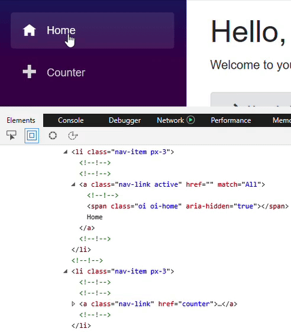

The simplest way to link to a route within a Blazor component is to use an HTML hyperlink.

<a href="/Counter">This works just fine</a>

Hyperlinks in a Blazor component are intercepted automatically. When a user clicks a hyperlink the browser will not send a request to the server, instead Blazor will update the URL in the browser and render whichever page is associated with the new address.

## Using the NavLink component

Blazor also includes a component for rendering hyperlinks with additional support for changing the HTML element's CSS class when address matches the URL.

If we look inside the _/Shared/NavMenu.razor_ component in the default Blazor application we'll mark-up that looks something like the following:

<NavLink class="nav-link" href="counter">
	 Counter
</NavLink>

The NavLink component decorates its child content with an HTML hyperlink. All attributes such as `class`, `href`, etc are rendered directly to the `<a>` element via [Attribute splatting](/components/code-generated-html-attributes/). There are two parameters of the NavLink component that provide additional behaviour.

The `ActiveClass` parameter specifies which CSS class to apply to the rendered `<a>` element when the URL of the browser matches the URL of the `href` attribute. If not specified, Blazor will apply a CSS class named "active".

## URL matching

The `Match` parameter identifies how the browser's URL should be compared to the `href` in order to decide whether or not the `ActiveClass` should be added to the element's `class` attribute.

Edit the _/Pages/Counter.razor_ file in a new Blazor app so that it can be reached from three URLs.

@page "/counter"
@page "/counter/1"
@page "/counter/2"

Then edit the _/Shared/NavMenu.razor_ component so the Counter menu item has two sub-menu links.

<li class="nav-item px-3">
	<NavLink class="nav-link" href="counter" Match=@NavLinkMatch.All>
		Counter
	</NavLink>
	<ul class="nav flex-column">
		<li class="nav-item px-3">
			<NavLink class="nav-link" href="counter/1" Match=@NavLinkMatch.All>
				Counter/1
			</NavLink>
		</li>
		<li class="nav-item px-3">
			<NavLink class="nav-link" href="counter/2" Match=@NavLinkMatch.All>
				Counter/2
			</NavLink>
		</li>
	</ul>
</li>

Also edit _/wwwroot/site.css_ and add the following so we easily see which NavLink elements are considered "active".

.nav-item a.active::after
{
	content: " \*";
	margin-left: 1em;
}

The three NavLink components navigate to `/counter`, `/counter/1`, and `/counter/2`, if we run the application and click the various links we'll see the following.

## NavLinkMatch

The `Match` parameter of the NavLink component accepts a value of the type `NavLinkMatch`. This tells the NavLink component how you want the browser's URL compared with the `href` attribute of the `<a>` element it renders to determine whether they are the same or not.

In the earlier example we specified `NavLinkMatch.All` for the `Match` parameter on every NavLink component. This meant we wanted Blazor to only consider each NavLink to be active if its `href` matched the browser's URL completely. If we now change the NavLink that links to /counter so its Match parameter is NavLinkMatch.Prefix we'll see it will be considered a match whenever the URL starts with `/counter`, so it will also match `/counter/1` and `/counter/2`.

To illustrate the difference, declare a field within the code section of _/Shared/NavMenu.razor_

NavLinkMatch MatchMode = NavLinkMatch.All; 

Find the `
` element add the following mark-up to bind a `<select>` to the new field.

<select @bind=MatchMode class="form-control">
	<option value=@NavLinkMatch.All>All</option>
	<option value=@NavLinkMatch.Prefix>Prefix</option>
</select>

Finally, find the NavLink with its `href` linking to `/counter` and change its `Match` parameter to `"@MatchMode"`. Your mark-up should now look something like this.

	<a class="navbar-brand" href="">NavigationViaHtml</a>
	<button class="navbar-toggler" @onclick=ToggleNavMenu>
		
	</button>

	<select @bind=MatchMode class="form-control">
		<option value=@NavLinkMatch.All>All</option>
		<option value=@NavLinkMatch.Prefix>Prefix</option>
	</select>
	<ul class="nav flex-column">
		<li class="nav-item px-3">
			<NavLink class="nav-link" href="" Match=@NavLinkMatch.All>
				 Home
			</NavLink>
		</li>
		<li class="nav-item px-3">
			<NavLink class="nav-link" href="counter" Match=@MatchMode>
				Counter
			</NavLink>
			<ul class="nav flex-column">
				<li class="nav-item px-3">
					<NavLink class="nav-link" href="counter/1" Match=@NavLinkMatch.All>
						Counter/1
					</NavLink>
				</li>
				<li class="nav-item px-3">
					<NavLink class="nav-link" href="counter/2" Match=@NavLinkMatch.All>
						Counter/2
					</NavLink>
				</li>
			</ul>
		</li>
	</ul>

@code {
	NavLinkMatch MatchMode = NavLinkMatch.All;

	bool collapseNavMenu = true;

	string NavMenuCssClass => collapseNavMenu ? "collapse" : null;

	void ToggleNavMenu()
	{
		collapseNavMenu = !collapseNavMenu;
	}
}

With either the Counter/1 or Counter/2 link selected, toggle the value of the `<select>`.

Despite the browser URL remaining unaltered, we can see the first Counter NavLink toggling between being active/not-active based on the setting of its `Match` parameter.

\[menu\_navigator\]
